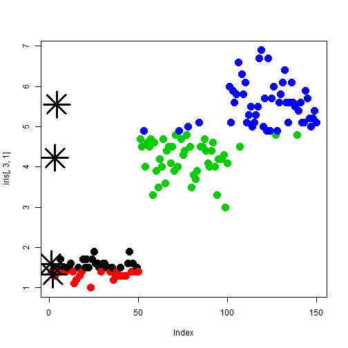

presenting a shiny app
========================================================
author: 
date: November 2014

First Slide
========================================================

This presentation describes how my shiny application works.

The app is available on https://www.shinyapps.io/
a repository for applications done with shiny. :-)

The application can be run from here: https://coding.shinyapps.io/ddpshinyapp/
The pitch presentation can be seen here: http://rpubs.com/pmeads/dppapp

Brief description
========================================================

The application uses the iris data set available for R and is an applicaiton of k-mean to determine the clusters on a data set.
To learn more about k-mean check the R documentation (or seach the internet) :).

The application shows how to manipulate several aspects of the plot and also
allows fot you to change the variables used and the number of kernels used to infer 
clusters from the data.

Slide With Plot
========================================================

The kmeans will try to find the numbers seletec on the data. A plot similar to the one here will beseen if you do a analysis with 4 cluester, the colors are dipecting the clusters and the kernels are displayed as asterics (*).

```r
clusters <- kmeans(iris[, 3, 1], 4)
plot(iris[, 3, 1], col = clusters$cluster, pch = 20, cex = 3)
points(clusters$centers, pch = 8, cex = 5, lwd = 3)
```

 

The application
========================================================
On the application we can change the variables we are trying to model, choose from the dropbox the x and y variables. 
We can also  put the sliders on an animation mode and see the plot change automatically.
We can also personalize the axis labels and the title.

On the right side we can see the result of changing the clusters being predicted on the plot of the model.
